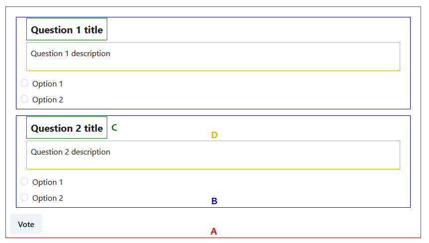

@vocdoni/react-voting
==========================

React components and hooks for easily integrating Vocdoni services.

Theming
-------

Since we're using chakra's theming system, the way to style these voting components
is [the same as described in their documentation][chakra theming], but using the
custom components we defined (see [components anatomy] for more details).

In order to start styling the voting components, you should use the
`ChakraProvider`, and customize the passed theme:

~~~tsx
// this can be imported from '@chakra-ui/react' too, but that's more generic
import { extendTheme } from '@chakra-ui/system'
import { theme } from '@vocdoni/react-voting'

export const App = () => (
  <ChakraProvider theme={extendTheme(theme)}>
    {/* YOUR APP CONTENTS */}
  </ChakraProvider>
)
~~~

As you can see, we're importing a custom defined theme from
`@vocdoni/react-voting`, but at the same time, we're using `extendTheme`.
This is because we're not merging our styles with the base chakra theme, both to
avoid a bigger bundle size and to ensure we don't unexpectedly overwrite styles.

The above example is the easiest way to get all the default styles up and running,
but you can always define your entire theme and ignore our base styles. See the
details about multipart components below.

In case you want to add the voting components to a page and ensure chakra-ui will
not affect your theme, you may need to pass `resetCSS={false}` as a component
prop:

~~~tsx
export const App = () => (
  <ChakraProvider resetCSS={false} theme={extendTheme(theme)}>
    {/* YOUR APP CONTENTS */}
  </ChakraProvider>
)
~~~

If you want to extend or change the theme, you can pass your changes as a second
argument to `extendTheme`:

~~~tsx
import { extendTheme } from '@chakra-ui/react'
import { theme as vtheme } from '@vocdoni/react-voting'

const theme = extendTheme(vtheme, {
  // any theme changes would go here
  components: {
    // [...]
  },
})

export const App = () => (
  <ChakraProvider theme={theme}>
    {/* YOUR APP CONTENTS */}
  </ChakraProvider>
)
~~~

Or you can simply ignore our theme and redefine it from the ground. All multipart
comonents export their helper theming methods, in case you want to ignore our
base theme.

### Components structure

- `components`: small components with part of the logic related to Vocdoni API
  (i.e. process questions).
- `components/views`: huge components containing all the required components for
  full featured flows (i.e. full featured voting page).
- `components/layout`: small components used for layout purposes.

The easiest way to integrate a voting would be to just import the `Views.Voting`
component:

~~~tsx
import { Views } from '@vocdoni/react-voting'
import { IElection } from '@vocdoni/sdk/dist/api/election'

const CustomVoteComponent = ({data: IElection}) => {
  return <Views.Vote data={data} />
}
~~~

### Components anatomy

#### Questions

- `A`: Main Wrapper
- `B`: Question Wrapper
- `C`: Question title
- `D`: Question description

Radio and Buttons are not defined as this component anatomy. Instead, we're using
the chakra components with a defined `voting` variant. In order to style those
you'll need to [style the variants][advanced theming]:

~~~ts
import { radioAnatomy } from '@chakra-ui/anatomy'
import { createMultiStyleConfigHelpers } from '@chakra-ui/react'
import { theme as vtheme } from '@vocdoni/react-voting'

const { defineMultiStyleConfig, definePartsStyle } = createMultiStyleConfigHelpers(radioAnatomy.keys)

const Radio = defineMultiStyleConfig({
  variants: {
    voting: definePartsStyle({
      label: {
        color: 'green',
      },
    }),
  },
})

const theme = extendTheme(vtheme, {
  components: {
    Radio,
  }
})
~~~

TODOS
-----

- Use context API for form state, rather than passing it as props (formik already
  has something, maybe there's no need to code a new hook).
- Add/create more voting related components, like the Heading Image one (with ipfs support ofc).
- Properly document everything, creating screenshots with properly defined
  sections for the components anatomy.

[components structure]: #components-structure
[components anatomy]: #components-anatomy
[chakra theming]: https://chakra-ui.com/docs/styled-system/customize-theme#customizing-theme-tokens
[advanced theming]: https://chakra-ui.com/docs/styled-system/advanced-theming
